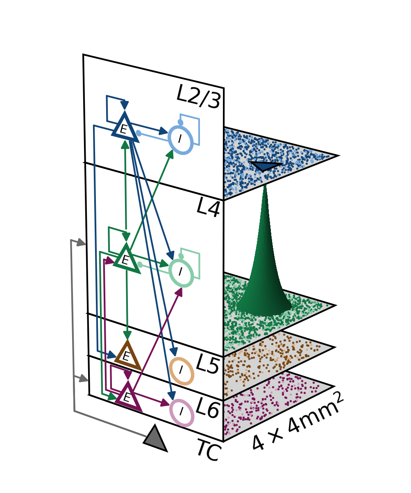

# Mesocircuit Model

[](https://mesocircuit-model.readthedocs.io/en/latest/?badge=latest)

<p align="center">

</p>

## Background

Mesoscopic, layered cortical network model with distance-dependent connectivity for spiking activity and local field potentials.

This repository provides the functionality to define, simulate, and analyze network models such as the mesocircuit model  in a self-contained framework.

Source code on GitHub: [https://github.com/INM-6/mesocircuit-model](https://github.com/INM-6/mesocircuit-model)

Documentation on ReadTheDocs: [https://mesocircuit-model.readthedocs.io](https://mesocircuit-model.readthedocs.io)

Please report bugs and feature requests as
[Issues](https://github.com/INM-6/mesocircuit-model/issues/new)
and contribute to source code or documentation via
[Pull Requests](https://github.com/INM-6/mesocircuit-model/compare).

## Citation

If you (re)use the code or otherwise find this resource useful, please respect the GPL-3 [LICENSE](https://github.com/INM-6/mesocircuit-model/blob/master/LICENSE.rst) agreement and cite the corresponding scientific publication:

- Johanna Senk, Espen Hagen, Sacha J van Albada, Markus Diesmann, Reconciliation of weak pairwise spike–train correlations and highly coherent local field potentials across space, Cerebral Cortex, Volume 34, Issue 10, October 2024, bhae405, https://doi.org/10.1093/cercor/bhae405

BiBTeX entry:

```bibtex
@article{10.1093/cercor/bhae405,
    author = {Senk, Johanna and Hagen, Espen and van Albada, Sacha J and Diesmann, Markus},
    title = "{Reconciliation of weak pairwise spike–train correlations and highly coherent local field potentials across space}",
    journal = {Cerebral Cortex},
    volume = {34},
    number = {10},
    pages = {bhae405},
    year = {2024},
    month = {10},
    abstract = "{Multi-electrode arrays covering several square millimeters of neural tissue provide simultaneous access to population signals such as extracellular potentials and spiking activity of one hundred or more individual neurons. The interpretation of the recorded data calls for multiscale computational models with corresponding spatial dimensions and signal predictions. Multi-layer spiking neuron network models of local cortical circuits covering about \$1\\,\{\\text\{mm\}^\{2\}\}\$ have been developed, integrating experimentally obtained neuron-type-specific connectivity data and reproducing features of observed in-vivo spiking statistics. Local field potentials can be computed from the simulated spiking activity. We here extend a local network and local field potential model to an area of \$4\\times 4\\,\{\\text\{mm\}^\{2\}\}\$, preserving the neuron density and introducing distance-dependent connection probabilities and conduction delays. We find that the upscaling procedure preserves the overall spiking statistics of the original model and reproduces asynchronous irregular spiking across populations and weak pairwise spike–train correlations in agreement with experimental recordings from sensory cortex. Also compatible with experimental observations, the correlation of local field potential signals is strong and decays over a distance of several hundred micrometers. Enhanced spatial coherence in the low-gamma band around \$50\\,\\text\{Hz\}\$ may explain the recent report of an apparent band-pass filter effect in the spatial reach of the local field potential.}",
    issn = {1460-2199},
    doi = {10.1093/cercor/bhae405},
    url = {https://doi.org/10.1093/cercor/bhae405},
    eprint = {https://academic.oup.com/cercor/article-pdf/34/10/bhae405/60093413/bhae405.pdf},
}
```

The older preprint version of the publication is available on arXiv:

- Johanna Senk, Espen Hagen, Sacha J van Albada, Markus Diesmann, Reconciliation of weak pairwise spike-train correlations and highly coherent local field potentials across space, arXiv:1805.10235v3 [q-bio.NC], 2024, https://doi.org/10.48550/ARXIV.1805.10235

Bibtex entry:

```bibtex
@article{Senk24_arxiv_v3,
  doi     = {10.48550/ARXIV.1805.10235},
  author  = {Senk, Johanna and Hagen, Espen and van Albada, Sacha J. and Diesmann, Markus},
  title   = {Reconciliation of weak pairwise spike-train correlations and highly coherent local field potentials across space},
  journal = {arXiv:1805.10235v3 [q-bio.NC]},
  year    = {2024}
}
```

## Code citation

The project's source code can be referenced as:

- Senk, J., & Hagen, E. (2024). Mesocircuit Model (v1.0.0). Zenodo. https://doi.org/10.5281/zenodo.13798936

BiBTeX entry:

```bibtex
@software{senk_2024_13798936,
  author       = {Senk, Johanna and
                  Hagen, Espen},
  title        = {Mesocircuit Model},
  month        = sep,
  year         = 2024,
  publisher    = {Zenodo},
  version      = {v1.0.0},
  doi          = {10.5281/zenodo.13798936},
  url          = {https://doi.org/10.5281/zenodo.13798936}
}
```

## Data download

The simulated data and codes to reproduce the figures for the published paper can be downloaded from Zenodo.org via

- Senk, J., & Hagen, E. (2024). Codes and data upload for Mesocircuit Model project [Data set]. In arXiv (v1.0.0, pp. 1805.10235v3). Zenodo. https://doi.org/10.5281/zenodo.13799066


Bibtex entry:

```bibtex
@dataset{senk_2024_13799066,
  author       = {Senk, Johanna and
                  Hagen, Espen},
  title        = {{Codes and data upload for Mesocircuit Model 
                   project}},
  month        = sep,
  year         = 2024,
  publisher    = {Zenodo},
  version      = {v1.0.0},
  doi          = {10.5281/zenodo.13799066},
  url          = {https://doi.org/10.5281/zenodo.13799066}
}
```
